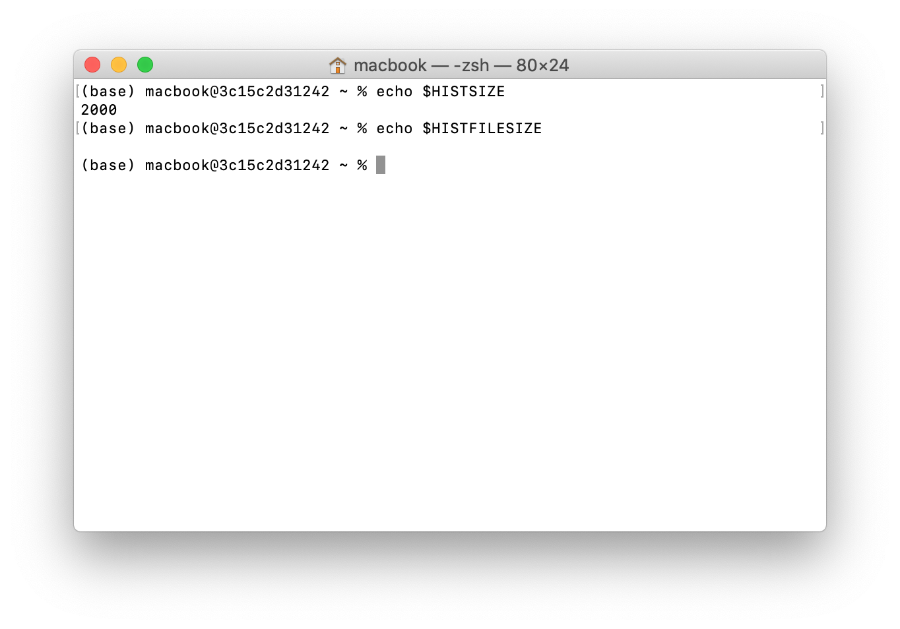
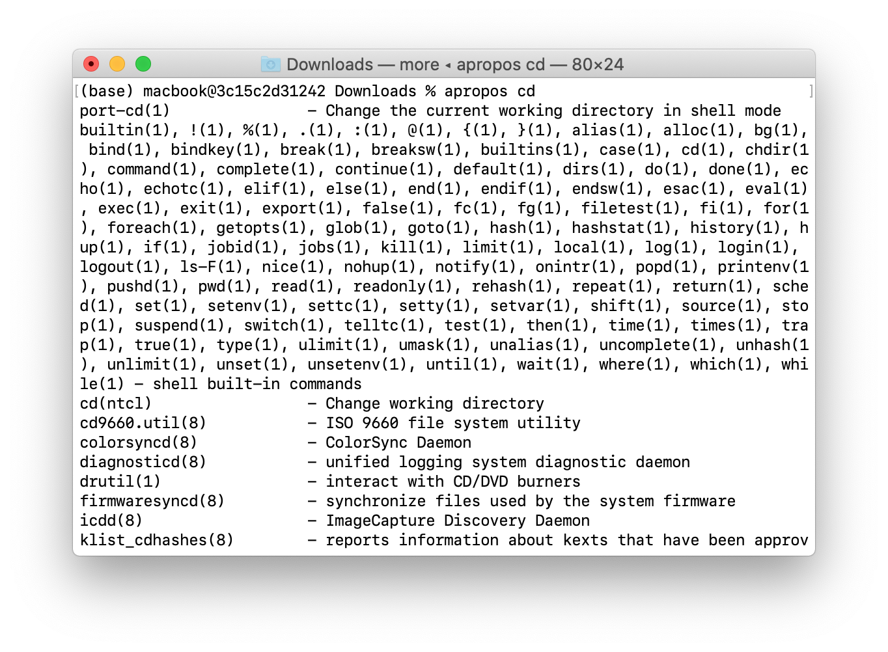

## ls - list directory contents

## pwd - print name of current/working directory

## clear - clear the terminal screen

## cd - change directory

## file — determine file type

## find - search for files in a directory hierarchy

## which - locate a command

## history - GNU History Library

> HISTSIZE       The number of commands to remember in the command history

> HISTFILESIZE   The number of lines or commands that (a) are allowed in the history file at startup time of a session, and (b) are stored in the history file at the end of your bash session for use in future sessions.

## apropos - search the manual page names and descriptions

## mkdir - make directories

## touch - change file timestamps

## cp - copy files and directories

## mv - move (rename) files

## rm - remove files or directories

## rmdir - remove empty directories

## echo - display a line of text

## cat - concatenate files and print on the standard output
 

## less - opposite of more

 

## chmod - change file mode bits

## sudo, sudoedit — execute a command as another user

